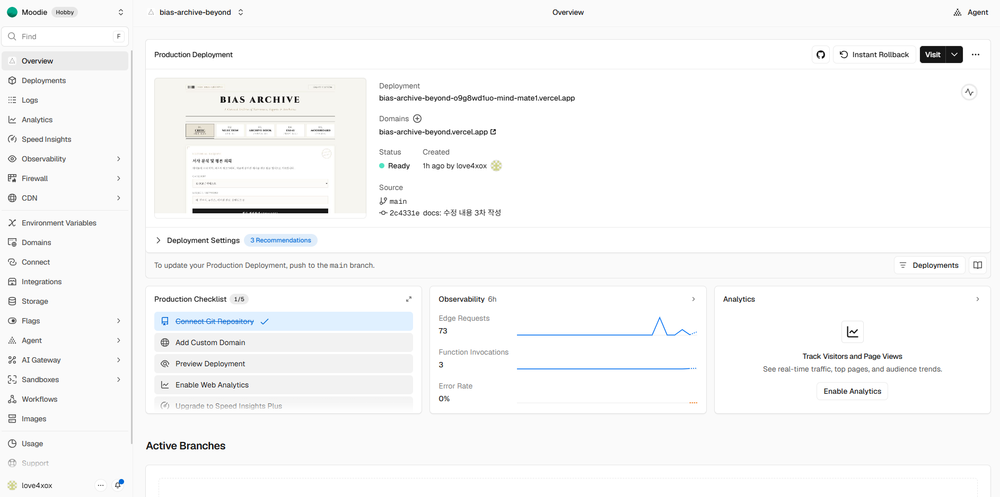
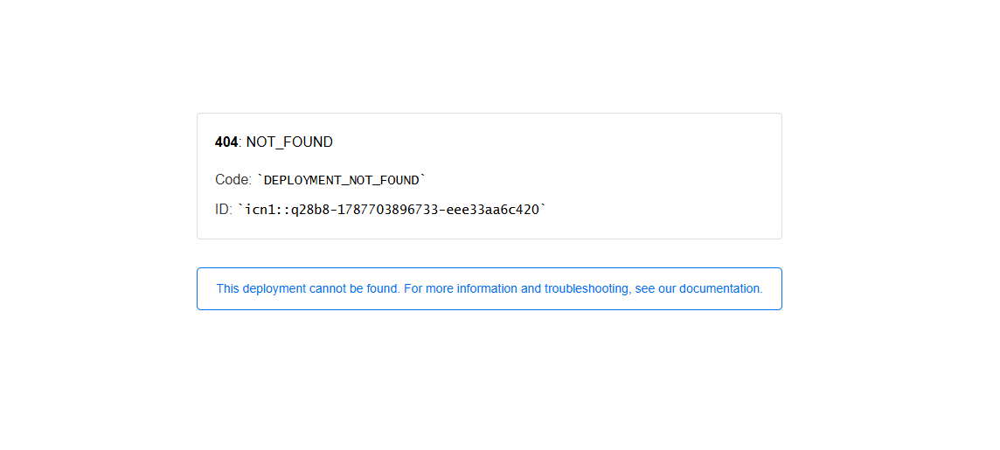
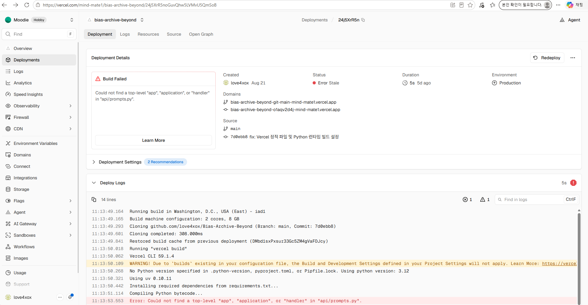
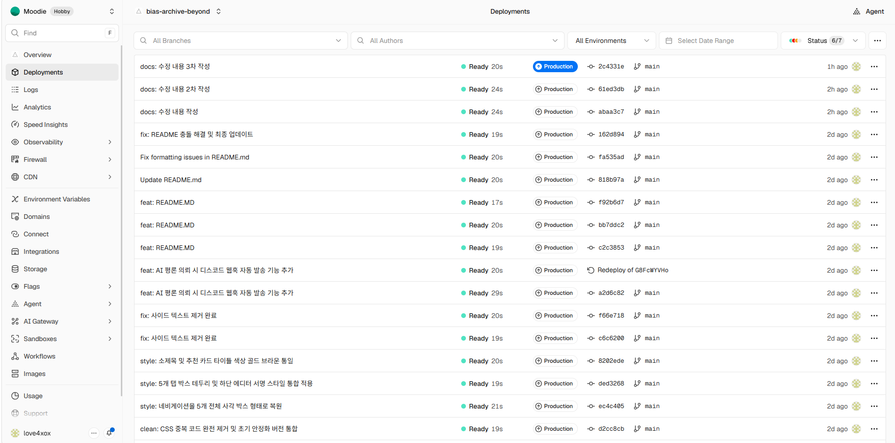

# 🧠 BIAS ARCHIVE 서비스 기획서

## 1. 서비스 명
* **서비스 국/영문 명칭:** BIAS ARCHIVE (바이어스 아카이브)
* **초기 프로토타입 명칭:** 최애 아카이브 (Fandom Archive : 입덕 백서 생성기)
* **슬로건:** “AI가 당신의 취향을 하나의 에디토리얼 매거진으로 편집한다.”

---

## 2. 서비스 정의
* **정의:** 사용자가 좋아하는 인물, 아티스트, 캐릭터, 작품 키워드를 입력하면, AI가 단순 정보 나열을 넘어 “감성 기반의 구조화된 디지털 매거진”으로 재구성해주는 AI 취향 아카이빙 플랫폼
* **핵심 지향점:** 단순 메모나 북마크를 넘어 “취향을 서사화하고 영구 소장 가능한 형태로 큐레이션해주는 콘텐츠 엔진”

---

## 3. 기획 배경 (문제 인식)
* **파편화된 팬덤 콘텐츠:** 유튜브 킬링 영상, 직캠, SNS 떡밥 등이 흩어져 있어 체계적인 아카이빙이 불가능함
* **입덕 설명의 한계:** "내 최애가 왜 좋은지" 친구나 대중에게 설명할 때 논리적이고 감성적인 서사 구조가 부족함
* **🔥 핵심 문제:** “좋아하는 건 너무 많은데, 왜 좋아하는지 구조화하여 입덕시킬 도구가 없는 상태”

---

## 4. 서비스 발전 과정 (초기 MVP ➔ 최종 Editorial 버전)
실제 사용자 피드백과 콘텐츠 확장성을 고려하여 2단계 이터레이션(Iteration)을 거쳐 프로덕트를 고도화했습니다.

```text
[Phase 1. 초기 MVP : 최애 아카이브] ────► [Phase 2. 최종 확장 : BIAS ARCHIVE]
· 타깃: K-POP 아이돌 팬덤 한정           · 타깃: 인물, 영화, 문학, K-POP 전반 확장
· 톤앤매너: 네오브루탈리즘 & 팝 핑크       · 톤앤매너: 클래식 지면 매거진 & 페이퍼 톤
· 산출물: '입덕 백서' (친근한 구어체)      · 산출물: '에디토리얼 평론 리포트' (격조 높은 문체)
· 4개 탭: 소개 / 가이드 / 보관함 / 킬링영상 · 5개 탭: CRITIC / SELECTION / BOOK / ESSAY / MOOD
```

* **초기 프로토타입 단계 (Phase 1 - 입덕 백서 MVP):**
  * **핵심 기능:** 아이돌 이름과 매력 포인트를 넣으면 '3대 킬링 포인트'와 '3단계 입덕 루트(귀/눈/마음)'를 담은 입덕 백서를 생성하고 '영업 백서 보관함'에 저장하는 구조 검증
  * **한계점 발견:** 디자인이 아이돌 팬덤에만 국한되고, 텍스트가 가벼워 영화·드라마·배우 등 깊이 있는 문화 콘텐츠 아카이빙으로 확장하기에 제약이 있음
* **최종 고도화 단계 (Phase 2 - Cinematic Editorial System):**
  * **지면 매거진 룩앤필 도입:** 아이돌 중심에서 영화배우, 시네마, 문학 서사까지 아우르는 정통 매거진 인터페이스 구축
  * **기능 확장:** 평론 의뢰(CRITIC), 트렌드 추천(SELECTION), 도서관형 서가(ARCHIVE BOOK) 등 5개 탭 SPA 구조로 전면 리브랜딩

---

## 5. 해결 전략 (3단 구조화)
* **5.1 AI 취향 해석 엔진:** 대상의 미학적 특성, 서사적 결, 비주얼 매력, 대표 유튜브 콘텐츠를 자동 결합 추출
* **5.2 매거진형 지면 구조화:** 단순 카드 나열이 아닌 COVER 헤드라인 ➔ 3단 심층 분석 ➔ 입덕 계기 ➔ 유튜브 추천 ➔ 에디터 서명으로 이어지는 클래식 지면 포맷 제공
* **5.3 영구 아카이빙 시스템:** 생성된 고품질 비평 리포트를 유실 없이 개인 서가에 편철하고 관리

---

## 6. 주요 기능 상세 명세
* **6.1 Bias 평론 생성 (CRITIC):** 카테고리(영화, 무대, 문학 등)와 키워드 입력 시 비동기 AI 평론 즉시 생성
* **6.2 Editorial 5탭 UI 시스템:** 01. CRITIC / 02. SELECTION / 03. ARCHIVE BOOK / 04. ESSAY / 05. MOODBOARD의 직관적 SPA 네비게이션
* **6.3 큐레이션 & 유튜브 연동:** 직캠/공식 영상 바로가기 버튼 및 한눈에 꽂히는 '영업 한마디' 도출
* **6.4 테마 및 반응형 시스템:** 라이트(종이 질감) / 다크 모드 토글, 모바일 가로 스크롤 최적화
* **6.5 실패 및 예외 처리 UX:**
  * **빈 입력(Validation):** 필수 키워드 누락 시 경고창을 띄우고 API 호출 차단
  * **지연 처리:** 응답 대기 시 "AI 에디터가 지면을 편집 중입니다..." 펄스 로딩 제공
  * **API 에러:** 통신 에러 발생 시 사용자 안내 메시지 노출

---

## 7. 타겟 사용자 및 니즈 분석
* **주 타깃:** K-POP 아이돌 팬덤, 영화/드라마 마니아, 서브컬처 캐릭터 애호가
* **부 타깃:** 문화 비평과 감성 에세이를 즐기는 2030 MZ세대
* **사용자 니즈:**
  * 내 최애의 매력을 단순 주접이 아닌 세련된 비평 텍스트로 정리하고 싶은 욕구
  * 친구나 입덕 예정자에게 신뢰도 높은 '입덕 가이드'를 전달하고 싶은 욕구

---

## 8. 차별성 및 핵심 포지셔닝

| 구분 | 초기 MVP (최애 아카이브) | BIAS ARCHIVE (최종본) |
| :--- | :--- | :--- |
| **콘셉트** | 네오브루탈리즘 팬덤 입덕 백서 | 시네마틱 클래식 에디토리얼 매거진 |
| **적용 범위** | K-POP 아이돌 중심 | 배우, 아이돌, 영화, 문학 전반 |
| **문체 & 톤** | 친근하고 귀여운 구어체 ("~배달왔어!") | 전문 비평가 톤앤매너 ("~장르에 탑승하세요") |
| **소장 가치** | 가벼운 메모/스티커 느낌 | 실제 인쇄 잡지를 소장하는 듯한 경험 |

---

## 9. 기술 아키텍처 및 디렉터리 구조

### 9.1 시스템 기술 스택
* **Frontend:** HTML5, CSS3, Vanilla JavaScript (SPA Routing, Fetch API)
* **Backend:** Vercel Serverless Functions (api/chat.py, Python 3.9+)
* **AI Engine:** Google Gemini API (gemini-3.5-flash)
* **Deployment & CI/CD:** GitHub, Vercel
* **Security & Ops:** GEMINI_API_KEY, DISCORD_WEBHOOK_URL 환경 변수 분리

### 9.2 디렉터리 구조 (Directory Tree)
```text
bias-archive/
├── api/
│   ├── chat.py             # Serverless POST 엔드포인트 (Gemini AI 및 Discord Webhook 연동)
│   └── prompts.py          # 매거진 에디터 페르소나 및 시스템 프롬프트 정의
├── public/
│   ├── assets/
│   │   ├── icons/
│   │   │   └── favicon.svg # 서비스 파비콘 벡터 아이콘
│   │   └── images/
│   │       └── og-banner.svg # SNS 공유용 오픈그래프(OG) 배너 이미지
│   ├── css/
│   │   ├── base.css        # 기본 리셋 및 글로벌 변수
│   │   ├── components.css  # 버튼, 입력 폼, 태그 컴포넌트 모듈
│   │   ├── dark.css        # 다크 모드 전용 테마 스타일
│   │   ├── layout.css      # 컨테이너 및 5개 탭 레이아웃
│   │   └── style.css       # 에디토리얼 매거진 통합 메인 스타일시트
│   ├── js/
│   │   └── app.js          # SPA 탭 라우팅, 비동기 fetch API 호출, DOM 렌더링
│   └── index.html          # 단일 페이지 애플리케이션(SPA) 메인 마크업
├── file/                   # 배포 및 디버깅 증빙 스크린샷 이미지 저장소
├── .env                    # 로컬 환경 변수 설정 파일 (Git 추적 제외)
├── .env.example            # 환경 변수 설정 템플릿 가이드
├── .gitignore              # Git 형상관리 제외 설정 파일
├── README.md               # 프로젝트 기술 명세 및 실행 가이드
├── requirements.txt        # Python 백엔드 의존성 패키지 정의서
└── vercel.json             # Vercel 서버리스 라우팅 및 빌드 설정 파일
```

---

## 10. UX 및 데이터 처리 흐름

```text
1. [사용자 입력] ─────> 2. [app.js Validation] ─────> 3. [fetch('/api/chat', POST)]
                                                               │
                                                               ▼
6. [매거진 렌더링/소장] <── 5. [JSON 파싱/DOM 변환] <── 4. [chat.py + Gemini AI]
                                                               │
                                                               └─> [Discord Webhook 알림]
```

* **1~2단계:** 사용자가 카테고리와 키워드를 입력하면, 브라우저 단(app.js)에서 공백 여부를 검증한 후 비동기 호출을 준비합니다.
* **3~4단계:** fetch('/api/chat')를 통해 백엔드 서버리스 함수로 데이터가 전달되며, 전문 에디터 프롬프트와 결합되어 Gemini AI 엔진을 호출합니다. 동시에 운영용 Discord Webhook으로 실시간 접수 알림을 발송합니다.
* **5~6단계:** AI가 반환한 정형 데이터를 수신하여 지면 마크다운을 파싱한 뒤, 실제 종이 잡지 레이아웃으로 화면에 렌더링하고 ARCHIVE BOOK에 영구 편철합니다.

---

## 11. 향후 확장 계획 (Roadmap)
* **11.1 공유형 입덕 페이지 (Web Link & Social Viral):**
  * 생성된 평론 매거진별 고유 식별 링크(URL) 발급
  * 트위터(X), 인스타그램 등 SNS 맞춤형 오픈그래프(OG) 카드 및 '입덕 가이드 공유' 기능 제공
* **11.2 PDF 인쇄 에디션 내보내기 (Printable Editorial Book):**
  * 웹 지면을 실제 실물 잡지 느낌의 A4 규격 PDF로 자동 변환 및 인쇄 레이아웃 다운로드 지원
* **11.3 팬덤 큐레이션 커뮤니티 (Collective Archive):**
  * 사용자 간 아카이브 북을 서로 열람하고 구독할 수 있는 공개 서가 시스템
  * 주간 베스트 비평 큐레이션 및 명예 에디터 선정 피드 운영

---

## 12. 한 줄 정의 및 기대 효과
* **한 줄 정의:** “AI가 당신의 취향을 하나의 매거진으로 편집한다.”
* **기대 효과:**
  * 개인의 파편화된 취향을 1편의 고품격 비평 아카이브로 자산화
  * '입덕 백서 MVP'에서 '에디토리얼 매거진'으로의 성공적인 프로덕트 스케일업 달성

---

## 13. 배포 주소
* 🌟 최애 아카이브: https://bias-archive-delta.vercel.app/
* 🌟 BIAS ARCHIVE: https://bias-archive-beyond.vercel.app/

---

## 14. 참고 자료
* 🧠 [BIAS ARCHIVE 서비스 기획서 (사진)](https://app.notion.com/p/BIAS-ARCHIVE-3c6333af6a15806fa5abd16211ac627e)
* 📑 [과제 3 기술 검증 및 심층 서술서](https://app.notion.com/p/3-3c6333af6a1580f78a98df8c3d34bddb)

---
---

# 📑 [평가 대비] 기술 검증 및 심층 서술서

## [항목 1] 필수 결과물 및 핵심 동작 검증

* **배포 URL 접속 및 메뉴 구성 (PASS)**
  * Vercel 배포 URL을 통해 실시간 접속이 가능합니다.
  * 총 5개 섹션(01. CRITIC, 02. SELECTION, 03. ARCHIVE BOOK, 04. ESSAY, 05. MOODBOARD)으로 구성되어 있으며, SPA(Single Page Application) 방식으로 새로고침 없이 상단 네비게이션을 통해 매끄럽게 전환됩니다.

  > **📷 [배포 증빙] Vercel 프로덕션 최종 배포 및 서비스 활성화 완료 (`Ready / Overview`):**  
  > 

* **반응형 웹 레이아웃 지원 (PASS)**
  * **데스크톱:** 5개 메뉴가 가로로 균등 배치되는 고정 지면 그리드 레이아웃을 제공합니다.
  * **모바일(768px 이하):** 상단 탭이 가로 스크롤(overflow-x: auto; flex-wrap: nowrap)로 유연하게 전환되며, 텍스트 줄바꿈 방지(white-space: nowrap) 및 카드 패딩 조정을 통해 화면 깨짐이나 글자 겹침 현상을 원천 방지했습니다.
* **AI 기능의 정상 동작 (입력 ➔ 요청 ➔ 결과 출력) (PASS)**
  * 사용자가 아티스트/키워드(예: '세븐틴 도겸', '변우석')를 입력하고 발행 요청을 누르면, 백엔드(api/chat.py)를 거쳐 Gemini AI가 생성한 에디토리얼 평론 리포트(헤드라인, 3단 미학 분석, 입덕 계기, 유튜브 바로가기 링크)가 화면에 마크다운 형태로 렌더링됩니다.
* **테스트 입력 재현성 (PASS)**
  * 단일 단어 입력(정상), 50자 이상의 구체적 취향 설명(긴 입력), 특수문자가 포함된 입력 등 3가지 이상의 다양한 테스트 케이스에서 오류 없이 일관된 포맷으로 결과를 생성합니다.
* **실패 상황 UX 안내 메시지 제공 (PASS)**
  * **빈 입력(Validation):** 필수 키워드 누락 시 alert("분석할 대상이나 키워드를 입력해 주세요.")를 호출하고 백엔드 API 요청을 차단합니다.
  * **지연 및 대기(Loading):** 생성 대기 중 AI 에디터가 지면을 편집 중입니다... 로딩 인디케이터와 펄스 애니메이션을 노출하여 사용자 이탈을 방지합니다.
  * **API 오류(4xx/5xx):** 통신 실패 시 *"서버와의 통신에 실패했습니다. 잠시 후 다시 시도해 주세요."*라는 에러 피드백을 화면에 표시합니다.
* **환경 변수 보안 관리 (PASS)**
  * GEMINI_API_KEY 및 DISCORD_WEBHOOK_URL을 프론트엔드 코드에 하드코딩하지 않고, .env 및 Vercel Environment Variables에 등록하여 백엔드(api/chat.py)에서만 안전하게 호출되도록 격리했습니다.
* **제출 패키지 5종 완비 (PASS)**
  * ① 배포 URL (Vercel) ② GitHub 리포지토리 ③ README.md ④ 서비스 기획서(상세 12챕터) ⑤ 증빙 자료(초기/최종 스크린샷 및 AI 협업 기록) 5종을 완벽히 제공합니다.

---

## [항목 2] 프로젝트 아키텍처 및 디버깅 프로세스

* **html / css / js / api 구조 분리 이유**
  * **관심사 분리(Separation of Concerns):**
    * `public/index.html`: 콘텐츠의 구조와 시맨틱 마크업 정의
    * `public/css/`: base.css, components.css, dark.css, layout.css, style.css로 모듈화하여 스타일링 유지보수성 향상
    * `public/js/app.js`: 탭 전환 라우팅, 유효성 검사, 비동기 fetch 및 DOM 조작 전담
    * `api/chat.py`: API 키 보호, AI 프롬프트 결합, Discord 웹훅 전송 등 서버리스 백엔드 비즈니스 로직 격리
* **프론트엔드 상태 처리 (로딩 / 성공 / 실패)**
  * JavaScript의 async/await 및 try...catch...finally 구문을 활용했습니다.
  * **로딩 시작:** 결과 영역 초기화, 로딩 스피너 활성화(display: flex), 의뢰 버튼 비활성화(disabled = true)
  * **성공(try):** 응답 JSON 데이터 파싱 후 지면 템플릿에 매핑하여 렌더링
  * **실패(catch):** 사용자 안내 에러 박스 노출 및 콘솔에 상세 에러 로깅
  * **종료(finally):** 로딩 스피너 해제 및 의뢰 버튼 활성화 원복
* **Serverless Function (Python)의 입력 검증 및 응답 포맷**
  * **입력 검증:** json.loads(post_data) 후 user_message의 존재 여부 및 공백을 확인하여 누락 시 {"error": "메시지가 비어 있습니다."}를 반환합니다.
  * **응답 포맷:** 성공 시 일관된 JSON 스키마({"reply": "...", "category": "..."})와 UTF-8 인코딩 헤더를 적용하여 프론트엔드 파싱 오류를 차단했습니다.
* **배포 후 문제 진단 및 수정 프로세스 (로그 ➔ 콘솔 ➔ 수정 ➔ 재배포)**
  * **1단계:** 브라우저 개발자 도구(F12)의 Console 및 Network 탭에서 상태 코드(404, 500, CORS 에러) 진단
  * **2단계:** Vercel 대시보드의 Deployment Functions Logs를 확인하여 백엔드 Python 예외 스택 트레이스 추적
  * **3단계:** 로컬(Cursor IDE)에서 코드 및 환경 변수 수정
  * **4단계:** Git 커밋 & 푸시를 통해 Vercel 자동 CI/CD 트리거 및 브라우저 강력 새로고침(Ctrl + F5)으로 최종 동작 검증

  > **📷 [디버깅 증빙 1] 배포 URL 404 접근 오류 화면 (`DEPLOYMENT_NOT_FOUND`):**  
  > 

  > **📷 [디버깅 증빙 2] Vercel 서버리스 빌드 에러 로그 (`Build Failed`):**  
  > 

  > **📷 [디버깅 증빙 3] 문제 해결 후 정상 배포 완료 내역 (`Deployments Ready`):**  
  > 

---

## [항목 3] 핵심 웹 지식 및 AI 프롬프트 엔지니어링

* **HTML / CSS / JavaScript / API의 역할 차이**
  * **1. 비유로 이해하는 4가지 역할:**
    | 구분 | 비유 (사람 / 집) | 역할 한 줄 요약 |
    | :--- | :--- | :--- |
    | **HTML** | 뼈대, 골격, 설계도 | 화면에 들어갈 텍스트, 버튼, 제목 등 내용의 구조를 잡음 |
    | **CSS** | 옷, 인테리어, 화장 | 색상, 폰트, 배치 등 화면을 시각적으로 꾸밈 |
    | **JS (JavaScript)** | 근육, 뇌 신경, 동작 | 버튼 클릭, 탭 전환, 데이터 요청 등 움직임과 기능을 처리함 |
    | **API** | 식당의 웨이터, 메신저 | 프론트엔드가 요청한 데이터를 백엔드/AI에서 가져다주는 다리 |

  * **2. 'BIAS ARCHIVE' 프로젝트 코드로 보는 실제 차이점:**
    * **HTML (`public/index.html`):** `<header class="magazine-header">`, `<div class="magazine-tabs">`, 입력 `<textarea>` 및 버튼 등 "여기에 잡지 제목이 들어가고, 여기에 입력창과 평론 발행 버튼이 있다"라고 화면의 뼈대를 만듭니다.
    * **CSS (`public/css/style.css`):** 지면 매거진 고유의 종이 질감 배경색, 골드 브라운 폰트, 모바일 가로 스크롤 레이아웃 등 "배경은 고급스러운 종이 질감으로 하고, 폰트는 골드 브라운 톤으로 맞추며, 모바일에서는 5개 탭이 가로로 스크롤되게 만든다"처럼 스타일과 디자인을 입힙니다.
    * **JS (`public/js/app.js`):** 탭 클릭 이벤트 리스너(`addEventListener`), 입력값 검증, 비동기 `fetch` 요청 및 마크다운 파싱 DOM 업데이트를 실행하여 사용자가 발행 버튼을 눌렀을 때 "글자가 비었는지 검사하고, 로딩 애니메이션을 띄운 뒤, 결과 데이터를 화면에 예쁘게 갈아 끼운다"는 동작과 논리를 실행합니다.
    * **API (`/api/chat` & Gemini API):** 자바스크립트(JS)가 "아이돌/키워드 분석해 줘"라고 요청하면, 서버리스 백엔드를 통해 Gemini AI에 가서 평론 글을 받아와 JS에게 전달해 주는 통로 역할을 합니다.

* **fetch 요청에서 응답까지의 흐름**
  * 사용자가 의뢰 폼을 제출하면 app.js가 입력값을 직렬화하여 fetch('/api/chat', { method: 'POST', body: ... })를 실행합니다.
  * Vercel 라우터가 이를 api/chat.py 서버리스 함수로 전달하고, 백엔드는 Gemini API를 호출하여 생성된 텍스트를 JSON으로 프론트엔드에 응답(Response)합니다. 브라우저는 이를 받아 DOM을 동적으로 변경합니다.
* **환경 변수를 사용하는 이유 (보안 / 운영)**
  * **보안:** API Key가 클라이언트(브라우저) 코드에 노출되면 악의적인 사용자에 의해 무단 도용 및 비정상 과금이 발생할 수 있습니다.
  * **운영 유연성:** 코드 수정이나 재빌드 없이 Vercel 대시보드에서 키 값을 즉시 교체하거나 운영/개발 환경을 분리할 수 있습니다.
* **AI 기능 도입 이유 및 프롬프트 구성 전략**
  * **도입 이유:** 사용자의 파편화된 취향을 단순 메모가 아닌 '전문 비평가의 시선이 담긴 지면 매거진'으로 격상시켜 소장 가치를 부여하기 위함입니다.
  * **프롬프트 구성 (api/prompts.py):**
    * `Role & Tone`: 대중문화 전문 시니어 에디터 페르소나 부여 (품격 있고 세련된 문체)
    * `Format`: [HEADLINE] ➔ [3-POINT ANALYSIS] ➔ [INSPIRATION] ➔ [YOUTUBE PICKS] 규격화
    * `Constraint`: 과도한 미사여구는 배제하고 구체적인 미학적 디테일과 추천 이유를 서술하도록 제한

---

## [항목 4] 확장성 및 비상 대응 시나리오

* **응답 지연 개선 옵션 (속도 / 비용 / 쿼터)**
  * **스트리밍(Streaming / SSE):** 전체 생성을 기다리지 않고 토큰 단위로 실시간 타이핑 효과를 프론트에 렌더링하여 체감 대기 시간 단축
  * **응답 캐싱(Caching):** 동일한 인기 키워드나 카테고리 요청에 대해 Redis나 메모리 캐시를 적용하여 중복 API 호출 방지 및 비용 절감
  * **경량 모델 분기:** 단순 큐레이션에는 경량 모델(gemini-1.5-flash)을 기본 적용하고, 심층 비평에만 상위 모델을 선택적으로 호출
* **AI 기능 2개 이상 확장 시 구조 설계**
  * **백엔드:** api/critic.py, api/essay.py, api/moodboard.py 등으로 서버리스 함수를 엔드포인트별로 모듈화하거나, api/chat.py 내부에서 type 파라미터 기반 라우팅 분기 처리
  * **프론트엔드:** API 통신 모듈(apiClient.js)을 공통화하여 여러 UI 탭 컴포넌트에서 재사용 가능하도록 구조화
* **API 키 유출 시 긴급 조치 및 재발 방지**
  * **즉시 조치:** AI 제공업체(Google AI Studio) 콘솔에 즉시 접속하여 유출된 키를 삭제(Revoke)하고, 신규 키를 발급받아 Vercel 환경 변수 교체 및 Redeploy 실행
  * **재발 방지:** Git 히스토리에서 민감 커밋 영구 제거(git filter-repo), .gitignore에 .env 등록 재검증, GitHub Secret Scanning 활성화
* **프론트엔드 프레임워크(React/Vue 등) 도입 시 장단점 및 변경 범위**
  * **장점:** 컴포넌트 기반 재사용성 증대, 선언적 상태 관리(useState, useEffect)로 복잡한 5개 탭/로딩 UI 관리 용이
  * **단점:** 번들 사이즈 증가로 인한 초기 로딩 속도 저하, 빌드 도구(Vite, Webpack) 파이프라인 관리 필요
  * **변경 범위:** 기존 index.html과 app.js의 명령형 DOM 직접 조작 코드를 React JSX 컴포넌트 및 가상 DOM 기반으로 전면 리팩토링 필요

---

## [항목 5] 보너스 과제 달성 내역 (크레딧 부여)

* **운영 자동화 연동 (Discord Webhook):** 사용자가 평론 생성을 완료하면 api/chat.py 백엔드에서 DISCORD_WEBHOOK_URL로 의뢰 카테고리와 키워드를 즉시 전송하는 실시간 운영 알림 파이프라인 완비
* **사용자 경험(UX) 및 인터랙션 고도화:** 클래식 종이 지면 테마 및 사용자 맞춤 다크/라이트 모드 완벽 지원, 모바일 뷰포트 맞춤형 인덱스 가로 스크롤 및 카드 호버 마이크로 인터랙션 적용
* **데이터 편철 시스템 (ARCHIVE BOOK):** 단발성 출력을 넘어 생성된 평론 결과를 브라우저 서가에 즉시 편철하고 영구 소장할 수 있는 아카이빙 UX 구축